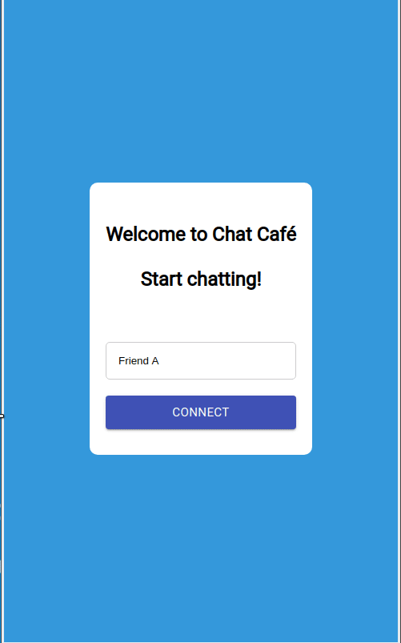

# Chat Café
A simple real-time chat application built using React, Redux, Socket.io and Firebase. Hosted on https://chat-cafe-client.vercel.app/

## To start this app
1. Start with running `git clone https://github.com/Kenny-Gin1/chat-cafe-client.git`
2. Be sure to be in the root folder and then run `npm install`
3. Start the server by running `npm start` and it will run on http://localhost:3000.
4. Be sure to repeat the steps above for the server which can be located at https://github.com/Kenny-Gin1/chat-cafe-server (**See separate instructions in that repo**)

### Demo

